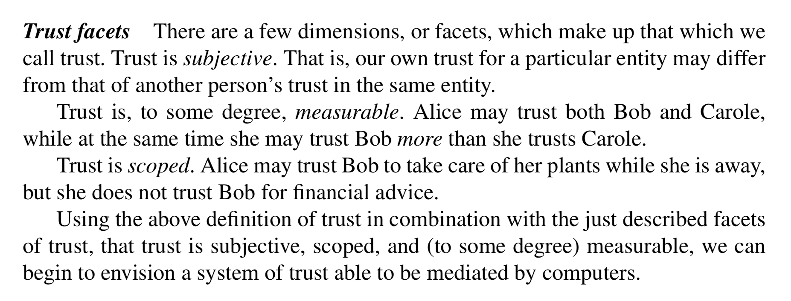

See also [[Counter-Intelligence]]

Exploring threat modelling, trust models and intelligence sharing practices for social movements

OSINT open intel - minimal threat due to open nature of information
Some negligible concern due to the aggregation 

Workplace intelligence 
- unidentifiable -> open
- Identifiable -> graded
Some information sharing could identify the rat by nature of the way information is shared organisationally. Access to identifying information should be graded and conditional on the trust level of the receiver. My hypothesis is that a computational and transitive networked trust model could help to semi-automate this negotiation 

https://cblgh.org/dl/trustnet-cblgh.pdf#page48

Trust and reputation are both relevant. Reputation for good politics, trust for integrity and responsibility could both factor in a decision

