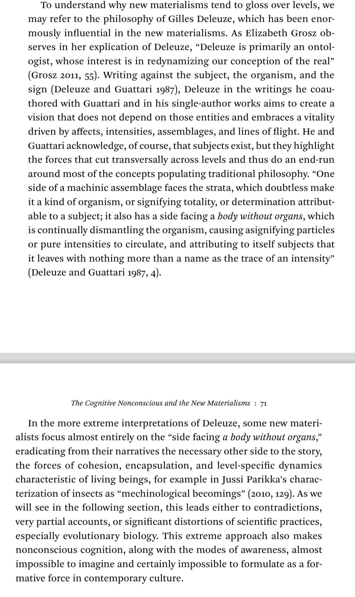

#MarxistTheory #SurplusValue #AutomatedSystems #EconomicActors #Capitalism #CommunistRevolution #MachineLabor #StateDynamics #BusinessAutomation #CognitiveAssemblage #EconomicProperties #UseValue #ExchangeValue #AutomationImpact #EconomicEfficiency #SystemicDomination #SocialStructures #CapitalistSocieties #ProfitRate #RevolutionaryTheory #StateFormation #IdeologicalReproduction 

[[Gilles Deleuze]] [[A Thousand Plateaus]]

There is apparently an aspect of Marx's thinking in which he considered labour to have economic properties unlike anything else, related to the difference between the use value and the exchange value of labour, which is the source of surplus value or profit. The story goes that he did not consider machines to contain such a differential in value. This may have some relation to his theory that capitalist societies would have an inevitably falling rate of profit which would, in turn, inevitably lead to Communist revolution. History has shown this to be wrong.

Machines can create surplus value. But not only machines, but all automated systems. They can perform useful tasks in much a less costly way than if a human were required to do those tasks. This is basically self-evident at this point. Automated systems are in fact extraordinarily important economic actors - they create the conditions of reality. 

Business logics and the State also exemplify these qualities of automation, no matter whether it is humans or machines which implement the parts of the system. The State, for example, is not really created by humans. It is more insightful to say that it uses humans to reproduce and expand itself into the future. It started as an idea created by humans, a way to formalise existing interpersonal relationships of domination into a social structure, and thereby make the domination more efficient. But the idea (and its associated concepts and processes), while dependant on humans for its survival, has a life of its own. It is a cognitive assemblage: it 

The State is 

